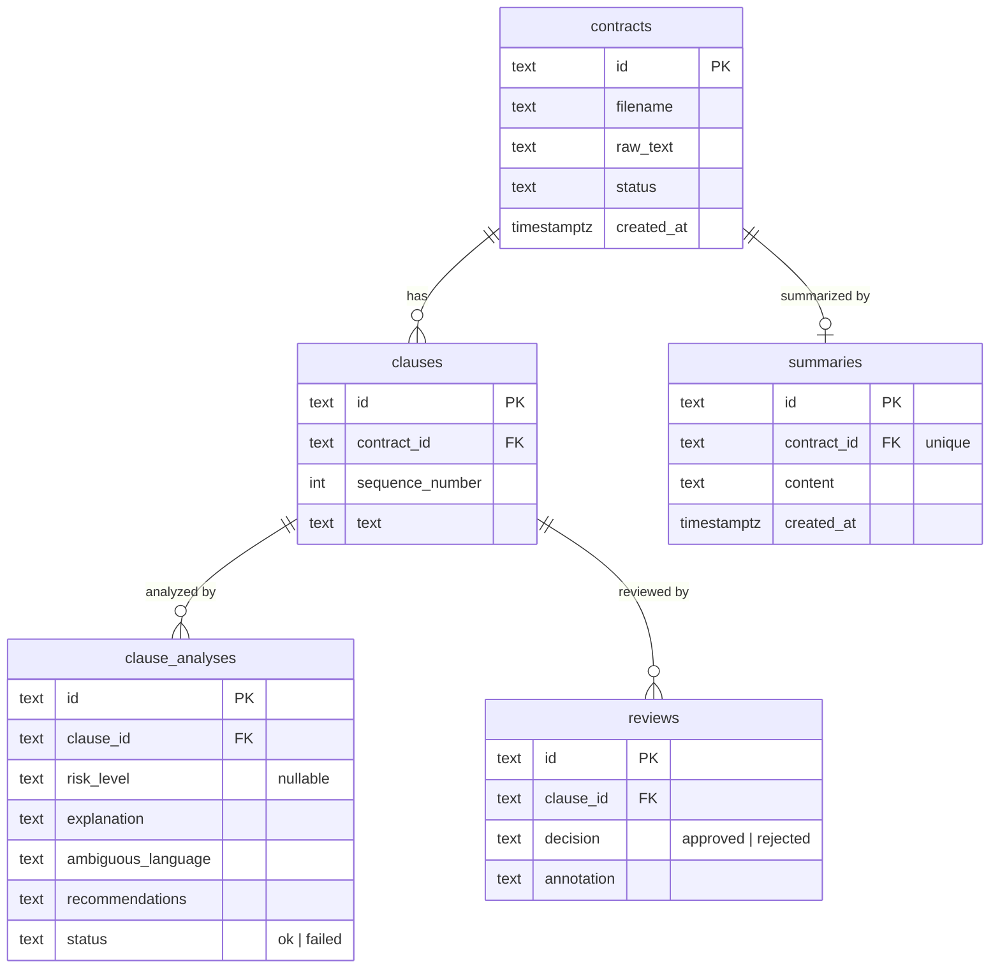

# Contract Review AI Agent

## Data Model

### Why each table exists

| Table | Purpose |
|---|---|
| `contracts` | The uploaded document. Tracks the raw text and processing status as it moves through the pipeline. |
| `clauses` | Individual clauses extracted from a contract. A contract is broken into clauses so each can be analyzed independently. |
| `clause_analyses` | The AI's finding for a single clause — risk level, explanation, and recommendations. One analysis per clause. |
| `reviews` | A human reviewer's decision on a clause (approved / rejected) with an optional annotation. |
| `summaries` | A single generated summary for the whole contract. One per contract. |

### Entity Relationship Diagram



### Contract status flow

```
uploaded → extracting → extracted → analyzing_clauses → clauses_extracted
→ analyzing → analyzed → review_pending → review_complete → summarizing → done
```

| Status | Meaning |
|---|---|
| `uploaded` | File received and stored; processing not yet started. |
| `extracting` | Raw text is being extracted from the document. |
| `extracted` | Raw text extraction complete; ready for clause splitting. |
| `analyzing_clauses` | Contract text is being split into individual clauses. |
| `clauses_extracted` | Clauses saved to the database; ready for AI analysis. |
| `analyzing` | AI is analyzing each clause for risk and ambiguity. |
| `analyzed` | All clause analyses saved; ready for human review. |
| `review_pending` | Waiting for a human reviewer to approve or reject clauses. |
| `review_complete` | All clauses reviewed; ready for summary generation. |
| `summarizing` | Summary of the full contract is being generated. |
| `done` | Pipeline complete; summary available. |
